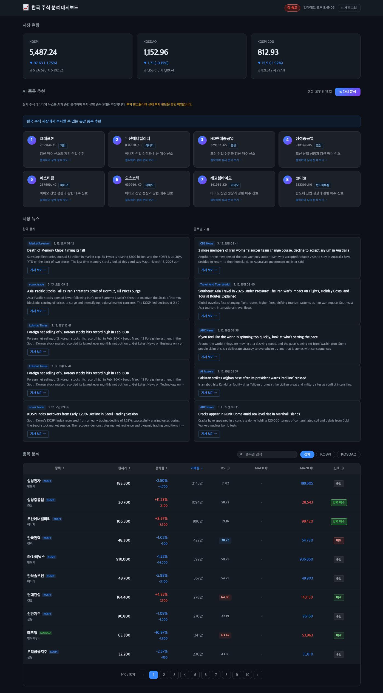

# 국내 주식 분석 대시보드

국내 주식 시장의 기술적 지표, 매매 신호, 글로벌 뉴스, AI 종목 추천을 제공하는 NestJS 기반 REST API + 웹 대시보드입니다.



## 주요 기능

- **백그라운드 캐시** - 서버 시작 시 전체 종목 데이터를 미리 수집, 30분마다 자동 갱신 (빠른 응답)
- **실시간 주가 데이터** - Yahoo Finance API를 통한 현재 주가 및 6개월 히스토리 데이터 조회
- **기술적 지표 계산** - RSI, MACD, 볼린저 밴드, 이동평균선(5/20/60/120일)
- **매매 신호 생성** - 복합 점수 기반의 강력매수/매수/중립/매도/강력매도 신호
- **시장 지수 조회** - KOSPI, KOSDAQ, KOSPI200 지수 및 시장 개장 여부
- **종목 검색** - 종목명 regex 검색 지원
- **시장 뉴스** - GNews API를 통한 한국 증시 뉴스 및 글로벌 이슈 제공
- **AI 종목 추천** - Groq LLM(LLaMA 3.3 70B)이 주가 데이터 + 뉴스를 종합 분석하여 투자 유망 종목 8개 추천
- **웹 대시보드** - 주가, 지표, 뉴스, AI 추천을 한눈에 볼 수 있는 UI

## 기술 스택

- **Runtime:** Node.js 18
- **Framework:** NestJS 10.x
- **Language:** TypeScript 5.x
- **HTTP Client:** Axios
- **Technical Analysis:** technicalindicators
- **News:** GNews API
- **AI:** Groq API (LLaMA 3.3 70B)
- **Config:** @nestjs/config

## 환경 변수

프로젝트 루트에 `.env` 파일을 생성하고 아래 값을 설정합니다.

```
GNEWS_API_KEY=your_gnews_api_key
GROQ_API_KEY=your_groq_api_key
```

- **GNews API 키**: [gnews.io](https://gnews.io) 에서 무료 발급 (하루 100건)
- **Groq API 키**: [console.groq.com](https://console.groq.com) 에서 무료 발급 (카드 등록 불필요)

## 프로젝트 구조

```
src/
├── main.ts
├── app.module.ts
├── stock/                           # 개별 종목 분석 모듈
│   ├── stock.module.ts
│   ├── stock.controller.ts
│   ├── constants/
│   │   └── kr-stocks.constant.ts   # 추적 종목 목록 (KOSPI 60 + KOSDAQ 40)
│   ├── services/
│   │   ├── yahoo-finance.service.ts
│   │   ├── technical-indicator.service.ts
│   │   └── stock-cache.service.ts  # 백그라운드 캐시 (30분 자동 갱신)
│   └── usecases/
│       ├── get-stock-list.usecase.ts
│       ├── get-stock-detail.usecase.ts
│       └── search-stocks.usecase.ts
├── market/                          # 시장 지수 모듈
│   ├── market.module.ts
│   ├── market.controller.ts
│   ├── services/
│   │   └── market-data.service.ts
│   └── usecases/
│       └── get-market-overview.usecase.ts
├── news/                            # 뉴스 모듈
│   ├── news.module.ts
│   ├── news.controller.ts
│   ├── services/
│   │   └── gnews.service.ts
│   └── usecases/
│       └── get-news.usecase.ts
└── recommendation/                  # AI 종목 추천 모듈
    ├── recommendation.module.ts
    ├── recommendation.controller.ts
    ├── services/
    │   └── groq.service.ts          # Groq LLM 연동
    └── usecases/
        └── get-recommendations.usecase.ts
```

## 설치 및 실행

```bash
# 의존성 설치
npm install

# 개발 서버 실행 (hot-reload)
npm run start:dev

# 빌드
npm run build

# 프로덕션 실행
npm start
```

서버는 기본적으로 **포트 3000**에서 실행됩니다.
대시보드는 브라우저에서 `http://localhost:3000` 으로 접속합니다.

> 서버 시작 시 백그라운드에서 전체 종목 데이터를 한 번 수집합니다. 최초 로딩이 완료되면 이후 요청은 캐시에서 즉시 반환됩니다.

## API 엔드포인트

### 시장 지수

| Method | Endpoint  | 설명 |
|--------|-----------|------|
| GET    | `/market` | KOSPI, KOSDAQ, KOSPI200 지수 및 시장 개장 여부 |

### 종목 분석

| Method | Endpoint          | 설명 |
|--------|-------------------|------|
| GET    | `/stocks`         | 전체 종목 목록 및 매매 신호 (쿼리: `?market=KOSPI\|KOSDAQ`) |
| GET    | `/stocks/search`  | 종목명 검색 (쿼리: `?query=삼성`, regex 지원) |
| GET    | `/stocks/:ticker` | 특정 종목 상세 분석 (예: `/stocks/005930.KS`) |

### 뉴스

| Method | Endpoint | 설명 |
|--------|----------|------|
| GET    | `/news`  | 한국 증시 뉴스(korean) + 글로벌 이슈(global) |

### AI 종목 추천

| Method | Endpoint           | 설명 |
|--------|--------------------|------|
| GET    | `/recommendations` | 주가 데이터 + 뉴스 기반 AI 종목 추천 8개 (Groq LLM) |

## 매매 신호 기준

| 신호 | 점수 범위 |
|------|----------|
| `strong_buy`  | 5점 이상  |
| `buy`         | 2 ~ 4점   |
| `neutral`     | -1 ~ 1점  |
| `sell`        | -2 ~ -4점 |
| `strong_sell` | -5점 이하 |

## 추적 종목

**KOSPI (60종목)**
삼성전자, SK하이닉스, 한미반도체, 삼성전기, LG에너지솔루션, 삼성SDI, 한화솔루션, 삼성바이오로직스, 셀트리온, 유한양행, 한미약품, 현대차, 기아, 현대모비스, 현대글로비스, NAVER, 카카오, 카카오뱅크, 카카오페이, 크래프톤, LG전자, 코웨이, KB금융, 신한지주, 하나금융지주, 우리금융지주, 삼성화재, 삼성생명, DB손해보험, LG화학, 롯데케미칼, 삼성물산, SK(주), LG(주), GS(주), SK이노베이션, 두산에너빌리티, 한국전력, HD현대중공업, 삼성중공업, HD한국조선해양, 한화에어로스페이스, 한국항공우주, 현대건설, GS건설, HMM, 대한항공, POSCO홀딩스, 현대제철, 고려아연, SK텔레콤, KT, LG유플러스, CJ제일제당, 오리온, 하이트진로, 이마트, 현대백화점, 호텔신라, 아모레퍼시픽

**KOSDAQ (40종목)**
에코프로비엠, 에코프로, 엘앤에프, 천보, 알테오젠, HLB, 파마리서치, 휴젤, 에스티팜, 오스코텍, 루닛, 레고켐바이오, 솔브레인, 리노공업, HPSP, 원익IPS, 이오테크닉스, 코미코, 테크윙, 펄어비스, 위메이드, 카카오게임즈, 덴티움, 클래시스, 포스코DX, 레인보우로보틱스, 안랩, 아프리카TV, SM엔터테인먼트, JYP엔터테인먼트, 와이지엔터테인먼트, 실리콘투, 파트론, 와이솔, 셀트리온제약, 두산테스나, 제넥신, ENF테크놀로지, 3S, 솔브레인홀딩스
